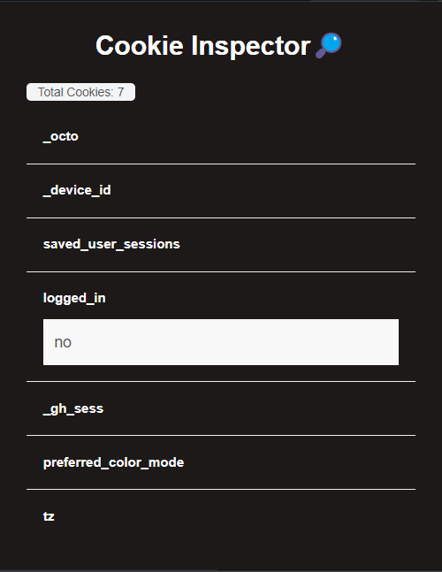

# 🍪 Cookie Inspector🔎

Cookie Inspector is a browser extension that allows users to view, edit, and manage cookies stored in their browser. This extension provides a user-friendly interface to handle cookies for better control and privacy.

<div align="center">
  
</div>

## 🚀 Features

- View all cookies for the current tab.
- Edit cookie values.
- Delete individual cookies.
- Displays total cookie count.

## 🛠️ Setup and Development

### Prerequisites

- Node.js
- npm (Node Package Manager)
- Webpack

### 📦 Installation

1. Clone the repository:
   ```bash
   git clone https://github.com/imshaaz21/Cookie-Inspector.git
   cd Cookie-Inspector
   ```
2. Install dependencies:
   ```bash
   npm install
   ```

## ⚙️ Development

1. Build the extension:

   ```bash
   npm run build
   ```

## 🗃️ Project Structure

```scss
cookie-inspector/
├── src/
│   ├── background.js
│   ├── dom.js
|   ├── popup.js
|   ├── utils.js
├── static/
│   ├── index.html
│   ├── manifest.json
│   ├── styles.css
│   ├── assets/
│       ├── icons/
│           ├── icon16.png
|           ├── icon32.png
│           ├── icon48.png
|           ├── icon64.png
│           ├── icon128.png
├── dist/
│   ├── (bundled files)
├── package.json
├── webpack.config.js
```

## 🖼️ UI Styling

Use `Tailwind CSS` for styling and `Font Awesome` for icons.


## 📝 Usage

1. Load the extension in Chrome:
   - Open Chrome and navigate to `chrome://extensions/`.
   - Enable "Developer mode".
   - Click "Load unpacked" and select the dist folder.
2. Click the extension icon to open the Cookie Inspector.

##  🔍 Viewing Cookies
1. Open the extension by clicking on its icon in the browser toolbar.
2. The extension will display all cookies associated with the current tab. If no cookies are found, a message "No cookies found" will be displayed.
3. Cookie count and domain information will be displayed at the top of the list.

## ✏️ Editing Cookies
1. Click on a cookie key to reveal the cookie value.
2. `Double-click` on the cookie value to make it editable. The value field will be highlighted.
3. Edit the value as needed.
4. Click outside the value field. The updated cookie value will be stored.

## 🗑️ Deleting Cookies
1. Click on the `trash icon` next to the cookie you want to delete.

## 📜 License

This project is licensed under the Apache License. See the [LICENSE](LICENSE) file for details.


## 🤝 Contributing

Contributions are welcome! Please fork the repository and submit a pull request.

## Reference

[1] Chrome Extensions Reference API [Online]. 
[Available here](https://developer.chrome.com/docs/extensions/reference/api/cookies)
. (last accessed 2024/05/26)


---

Made with ❤️ by imshaaz
