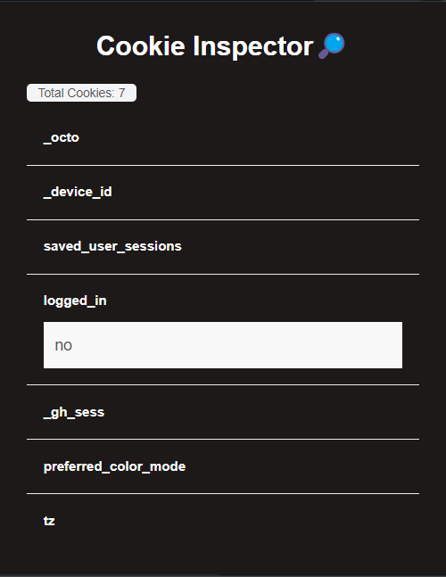

# 🍪 Cookie Inspector🔎

Cookie Inspector is a browser extension that allows users to view, edit, and manage cookies stored in their browser. This extension provides a user-friendly interface to handle cookies for better control and privacy.

<div align="center">
  
</div>

## 🚀 Features

- View all cookies for the current tab.
- Edit cookie values.
- Delete individual cookies.
- Displays total cookie count.

## 🛠️ Setup and Development

### Prerequisites

- Node.js
- npm (Node Package Manager)
- Webpack

### 📦 Installation

1. Clone the repository:
   ```bash
   git clone https://github.com/your-username/cookie-inspector.git
   cd cookie-inspector
   ```
2. Install dependencies:
   ```bash
   npm install
   ```

## ⚙️ Development

1. Start the development server with Webpack:

```bash
npm start
```

2. Build the extension:

```bash
npm run build
```

## 🗃️ Project Structure

```scss
cookie-inspector/
├── src/
│   ├── background.js
│   ├── popup.js
├── static/
│   ├── index.html
│   ├── manifest.json
│   ├── styles.css
│   ├── assets/
│       ├── icons/
│           ├── icon16.png
|           ├── icon32.png
│           ├── icon48.png
|           ├── icon64.png
│           ├── icon128.png
├── dist/
│   ├── (bundled files)
├── package.json
├── webpack.config.js
```

## 🖼️ UI Styling

Use `Tailwind CSS` for styling and `Font Awesome` for icons.

## 📝 Usage

1. Load the extension in Chrome:
   - Open Chrome and navigate to `chrome://extensions/`.
   - Enable "Developer mode".
   - Click "Load unpacked" and select the dist folder.
2. Click the extension icon to open the Cookie Inspector.

## 📜 License

This project is licensed under the Apache License. See the [LICENSE](LICENSE) file for details.

## 🙏 Acknowledgements

- Tailwind CSS
- Font Awesome

## 🤝 Contributing

Contributions are welcome! Please fork the repository and submit a pull request.

---

Made with ❤️ by imshaaz
